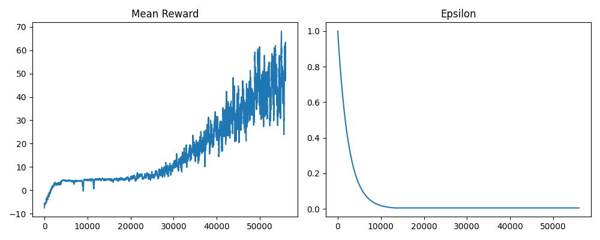

# Flappy Bird DQN Project

This project implements a Deep Q-Network (DQN) agent to learn to play the game Flappy Bird. It was developed as part of a CS465 AI class and utilizes the `flappy_bird_gymnasium` environment.

[](https://www.youtube.com/watch?v=UIHJSo5Q3Pw)

## Project Structure

```
dqn/
├── assets/             # Contains images for the README (e.g., training plots)
├── runs/               # Directory for storing training logs, models, and plots (ignored by git)
├── .DS_Store           # macOS specific file (ignored by git)
├── agent.py            # Main script defining the Agent class, training loop, and hyperparameter loading
├── dqn.py              # Defines the DQN neural network architecture (including Dueling DQN option)
├── experience_replay.py # Implements the ReplayBuffer for experience replay
├── hyperparameters.yml # Configuration file for various hyperparameter sets
├── .gitignore          # Specifies intentionally untracked files
├── README.md           # This file
└── requirements.txt    # Python dependencies
```

## Files

*   **`agent.py`**: This is the core script.
    *   Defines the `Agent` class which manages the Flappy Bird environment (`flappy_bird_gymnasium`), DQN policy and target networks, epsilon-greedy action selection, and the training loop.
    *   Loads hyperparameters from `hyperparameters.yml`.
    *   Implements logic for Double DQN and Dueling DQN based on loaded hyperparameters.
    *   Handles training, model saving (checkpoints and best model), metric logging (rewards, epsilon, loss to CSV), and plotting of results.
    *   Includes a `FrameSkip` wrapper for the environment to accelerate training.
    *   Parses command-line arguments for training, rendering, and evaluating specific checkpoints.
*   **`dqn.py`**:
    *   Defines the `DQN` neural network class using PyTorch (`torch.nn.Module`).
    *   The network is an MLP. It can be configured as a standard DQN or a Dueling DQN.
        *   **Standard DQN**: Consists of an input layer, one configurable hidden layer with ReLU activation, and an output layer predicting Q-values for each action.
        *   **Dueling DQN**: After a shared hidden layer, it splits into a value stream and an advantage stream, which are then combined to produce Q-values. This can improve learning by decoupling state value estimation from action advantage estimation.
*   **`experience_replay.py`**:
    *   Contains the `ReplayMemory` class.
    *   Uses a `collections.deque` to store (state, action, reward, next_state, done) transitions up to a maximum size.
    *   Provides methods to append new experiences and randomly sample a batch of experiences for training, which helps break correlations and stabilize learning.
*   **`flappybird1.pt`**: An example PyTorch model file containing saved weights of a trained DQN agent.
*   **`hyperparameters.yml`**: A YAML file to store and manage different sets of hyperparameters for the DQN agent (e.g., learning rate, discount factor, epsilon decay, replay buffer size, batch size, network hidden size, Double/Dueling DQN flags). This allows for easy experimentation.
*   **`requirements.txt`**: Lists the Python packages required to run the project (e.g., `pygame`, `torch`, `numpy`, `PyYAML`, `flappy_bird_gymnasium`).
*   **`assets/`**: Directory intended to store static assets like images used in this README.
*   **`runs*/`**: Directories where training outputs (logs, saved models, plots, CSV metrics) are stored. These are ignored by Git.

## Setup

To set up this project, you'll need Python and the libraries listed in `requirements.txt`.

1.  **Clone the repository:**
    ```bash
    git clone <your-repository-url> # Replace with your actual repository URL
    cd dqn # Or your project's root directory name
    ```

2.  **Create a virtual environment (recommended):**
    ```bash
    python3 -m venv venv
    source venv/bin/activate  # On Windows use `venv\Scripts\activate`
    ```

3.  **Install dependencies:**
    ```bash
    pip install -r requirements.txt
    ```

## Usage

The primary way to interact with the project is through `agent.py`.

### Training a New Agent

To train a new agent, you need to specify a hyperparameter set defined in `hyperparameters.yml`.

1.  **Configure `hyperparameters.yml`**: Ensure the desired hyperparameter set (e.g., `flappybird_set1`) is defined with appropriate values for learning rate, epsilon, network architecture, Double/Dueling DQN flags, etc.

2.  **Run the training script:**
    Replace `your_hyperparameter_set_name` with the actual name from the YAML file.
    ```bash
    python agent.py your_hyperparameter_set_name --train
    ```
    *   Example: `python agent.py flappybird_default --train`
    *   Training progress (rewards, epsilon, loss) will be saved in a subdirectory under `runs/` (e.g., `runs/flappybird_default/`).
    *   Model checkpoints will be saved periodically, and the best model (based on reward) will be saved as `runs/<set_name>/<set_name>.pt`.
    *   Plots of mean reward and epsilon will also be generated.
    *   Use `--checkpoint-interval <episodes>` to control how often checkpoints are saved (default is 50).

### Playing/Evaluating with a Pre-trained Agent

To run the game with a pre-trained agent and see it play (optionally with rendering):

1.  **Specify the hyperparameter set** that corresponds to the model you want to load. This is needed to build the correct network architecture.
2.  **Provide the path to the model checkpoint** (`.pt` file).

```bash
python agent.py your_hyperparameter_set_name --checkpoint-file path/to/your/model.pt [--render]
```
*   Example (using the provided `flappybird1.pt` and assuming it matches a set named `flappybird_set_for_pt1` in `hyperparameters.yml`):
    ```bash
    python agent.py flappybird_set_for_pt1 --checkpoint-file flappybird1.pt --render
    ```
*   If `--checkpoint-file` is omitted, it will attempt to load `runs/<set_name>/<set_name>.pt`.
*   The `--render` flag will display the game window.

## Implementation Details

*   **Environment**: `flappy_bird_gymnasium` is used as the game environment.
*   **State Representation**: (Please specify from your paper - e.g., bird's y-position, velocities, pipe distances. `agent.py` shows `state_dim = env.observation_space.shape[0]`, so the specifics depend on the environment's observation space).
*   **Actions**: The agent can choose between two actions: flap (jump) or do nothing.
*   **Network Architecture**: A Multi-Layer Perceptron (MLP) is used.
    *   The number of hidden units in the first layer is configurable via `fc1_nodes` in `hyperparameters.yml`.
    *   **Dueling DQN**: If `enable_dueling_dqn` is true, the network splits into value and advantage streams after the first hidden layer. Each stream has an additional hidden layer of 256 units before their respective outputs.
*   **Reward Function**: (Please specify from your paper or how the `flappy_bird_gymnasium` environment defines it - typically +1 for passing a pipe, -1 for crashing, and a small positive reward for surviving each frame).
*   **Key Hyperparameters (configurable in `hyperparameters.yml`):**
    *   `learning_rate_a`: Adam optimizer learning rate.
    *   `discount_factor_g` (gamma): Importance of future rewards.
    *   `network_sync_rate`: How often the target network is updated with the policy network's weights (in steps).
    *   `replay_memory_size`: Capacity of the experience replay buffer.
    *   `mini_batch_size`: Number of experiences sampled from replay memory for each training step.
    *   `epsilon_init`, `epsilon_decay`, `epsilon_min`: Parameters for epsilon-greedy exploration.
    *   `fc1_nodes`: Size of the first hidden layer.
    *   `frame_skip`: Number of frames to repeat an action for.
    *   `enable_double_dqn`: Boolean to enable/disable Double DQN.
    *   `enable_dueling_dqn`: Boolean to enable/disable Dueling DQN.
*   **Training Enhancements**:
    *   **Double DQN**: Used if `enable_double_dqn` is true, helps reduce overestimation of Q-values. The policy network selects the best action for the next state, and the target network evaluates that action.
    *   **Dueling Network Architecture**: Used if `enable_dueling_dqn` is true.
    *   **Experience Replay**: Decorrelates experiences and improves learning stability.
    *   **Frame Skipping**: Speeds up training.

## Results

Below is a visual representation of the agent's performance during training (e.g., rewards over episodes).


